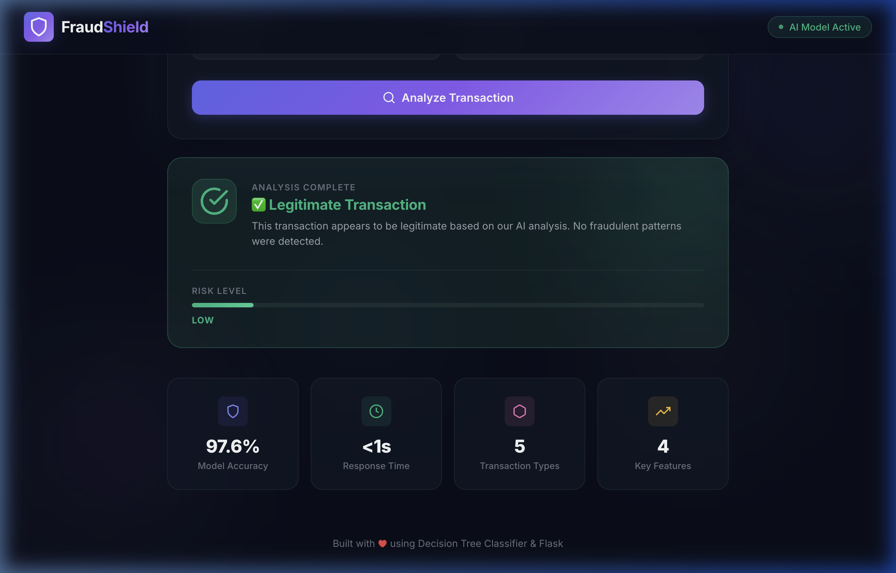

# Online Payments Fraud Detection

> A comprehensive, real-time web application for detecting fraudulent online payment transactions using Machine Learning.


---

## Technical Overview

The global adoption of online payment systems has revolutionized financial transactions by providing unprecedented speed, convenience, and accessibility. However, this digitalization has concurrently triggered a significant surge in sophisticated payment fraud, threatening financial security and user trust. 

This project directly addresses this critical challenge by providing a robust, **Machine Learning-powered web application** capable of classifying online transactions as fraudulent or legitimate in real-time. By analyzing transaction metadata as it happens, the system can flag suspicious activities before they manifest into financial losses.

The application's core intelligence relies on a custom-trained **Decision Tree Classifier** developed using the Scikit-Learn framework. This model was carefully chosen for its interpretability and high accuracy in identifying anomalous transaction patterns within highly imbalanced financial datasets. The application leverages a scalable Flask backend to serve the serialized model, exposing a RESTful API that interfaces seamlessly with a responsive, modern HTML/CSS/JavaScript frontend.

### Key Capabilities
- **Real-Time Classification Matrix**: Processes inbound transaction details and instantly executes classification, returning actionable results in milliseconds.
- **Multifaceted Transaction Support**: The inference engine is trained to evaluate 5 distinct transaction archetypes: Cash Out, Payment, Cash In, Transfer, and Debit, covering the vast majority of standard banking operations.
- **Core Financial Metrics Analysis**: Evaluates specific transaction attributes with high predictive power, focusing heavily on transaction amount, origin account balance prior to the transaction, and the resulting origin account balance.
- **Explainable AI Integration**: Decision Tree architecture allows for straightforward interpretation of the model's decision pathways, making audit and compliance checks easier.

---

## System Architecture

The application is built on a modular, decoupled architecture, separating the machine learning inference engine from the web presentation layer.

| Component | Technology | Purpose |
| :--- | :--- | :--- |
| **Backend & API** | Python, Flask, Werkzeug | Lightweight web server infrastructure ensuring low-latency API routing and request handling. |
| **Machine Learning Model** | Scikit-Learn | Core predictive engine utilizing a Decision Tree model tailored for binary classification tasks. |
| **Data Processing Layer** | NumPy, Pandas | High-performance data manipulation, preprocessing pipelines, and rapid feature extraction. |
| **Frontend Interface** | HTML5, CSS3, Vanilla JS | A dynamically responsive, dark-themed user interface utilizing glassmorphism principles for intuitive transaction input. |
| **Model Persistence** | Python Pickle | Efficient object serialization for saving the trained ML model and deploying it into the Flask context. |

---

## Application Interface & Workflow

The web application provides a straightforward, highly visual interface engineered for rapid data entry and immediate results comprehension.

### 1. Transaction Analysis Form
The primary interface allows analysts or automated test scripts to input precise transaction parameters. The form is strictly typed to prevent erroneous data submission, ensuring only clean data reaches the prediction API.


### 2. Result Visualization
Upon data submission, the Flask backend routes the payload to the loaded model, which generates a prediction. The interface then dynamically visually updates, employing distinct color cues and clear typography to indicate whether the transaction is deemed safe (legitimate) or potentially fraudulent (high risk).


---

## Codebase Organization

The repository is modularly structured to distinctly separate production source code, analytical notebooks, documentation, and demonstration resources:

```text
Document/
   └── Project_Documentation.pdf    # Comprehensive documentation covering architecture, EDA details, and system blueprints.
Project Files/
   ├── app.py                       # Main Flask web application defining routes and prediction logic.
   ├── retrain_model.py             # Utility script allowing developers to regenerate the trained machine learning model from source data.
   ├── main.ipynb                   # Primary Data Science notebook containing Exploratory Data Analysis (EDA) and the entire ML training pipeline.
   ├── static/                      # Static web assets: CSS styling definitions, images, and the compiled serialized model (`model.pkl`).
   └── templates/                   # HTML structure files powered by Jinja2 templating (e.g., `index.html`).
Video Demo/
   └── video demo.mov               # Video walkthrough demonstrating end-to-end application usage and deployment.
README.md                           # Project documentation (this document).
```

---

## Local Development & Deployment

Follow these comprehensive instructions to configure, launch, and test this full-stack application within your local development environment.

### Prerequisites
- **Python:** Version 3.8 or higher.
- **Git:** For version control operations.
- **Virtual Environment Tool (Optional but Recommended):** e.g., `venv` or `conda` to isolate dependencies.

### Step 1: Clone the Source Repository
Secure a local copy of the codebase and navigate into the primary application directory:
```bash
git clone https://github.com/pujith-k/-Online-Payments-Fraud-Detection-using-Machine-Learning.git
cd -Online-Payments-Fraud-Detection-using-Machine-Learning
cd "Project Files"
```

### Step 2: Establish a Virtual Environment & Install Dependencies
It is considered a best practice to encapsulate the project's dependencies to prevent conflicts with globally installed Python packages.

Create and activate the environment:
```bash
# On macOS and Linux:
python3 -m venv venv
source venv/bin/activate

# On Windows:
python -m venv venv
.\venv\Scripts\activate
```

Next, utilize the standard package manager to install the required libraries:
```bash
pip install --upgrade pip
pip install flask scikit-learn numpy pandas
```

*Note: If you plan on running the `main.ipynb` notebook locally, ensure you also install `jupyter`.*

### Step 3: Initialize the Application Server
Run the foundational Flask application script to boot the web server:
```bash
python3 app.py
```
Upon successful execution, the terminal will indicate that the development server is active.  Open your preferred web browser and navigate to:
**`http://127.0.0.1:5000/`**

---

## Data Science Foundation: The PaySim Dataset

The intelligence of this application is founded upon the well-regarded [PaySim synthetic financial dataset](https://www.kaggle.com/ealaxi/paysim1), publicly available via Kaggle. PaySim algorithmically simulates mobile money transactions based on a proprietary sample of real transactional logs extracted over the course of an actual month from a mobile money service implemented in an unspecified African nation.

- **Scale & Volume:** The full dataset encompasses **6,362,620 individual transaction records**.
- **The Imbalance Challenge:** Intrinsically reflecting real-world conditions, the dataset exhibits severe class imbalance. A mere **0.13% of all simulated transactions represent actual fraudulent activity**. The chosen model techniques strictly account for this disparity to avoid high false-negative rates.
- **Feature Engineering Integration:** Through rigorous feature selection encapsulated in the `main.ipynb` EDA process, the application zeroes in on specific vectors—notably `type`, `amount`, `oldbalanceOrg`, and `newbalanceOrig`—which yield the highest information gain during model training.

---

## Project Engineering Team

The design, data analysis, and software engineering for this system were collaboratively executed by the following individuals:

| Name | Role |
| :--- | :--- |
| **P Varshitha** | Team Leader |
| **G Lokanath Reddy** | Software Engineer |
| **K Pujith** | Data Scientist & Machine Learning Engineer |
| **T Sruthi** | Frontend Developer |

**Academic Institution:** Annamacharya Institute of Technology & Sciences  
**Registered Team Identification:** LTVIP2026TMIDS41562
